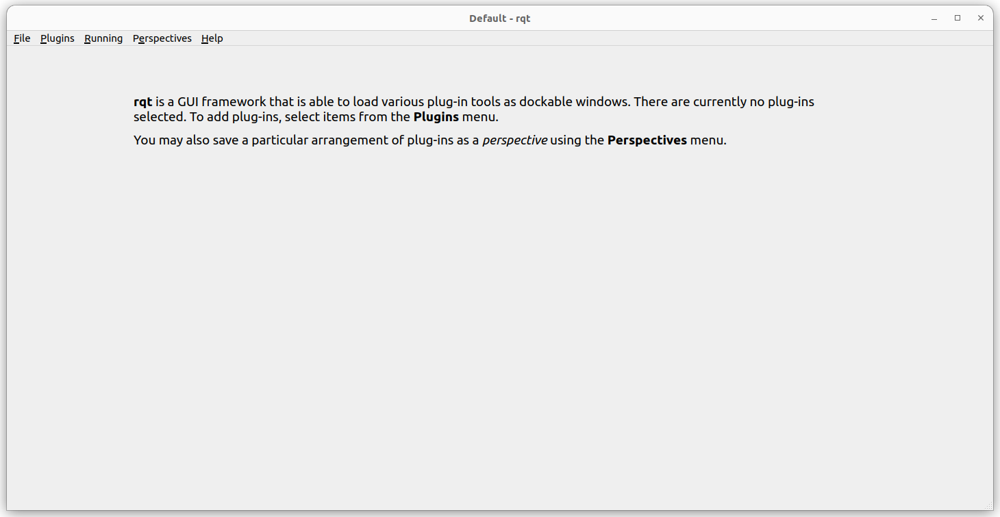
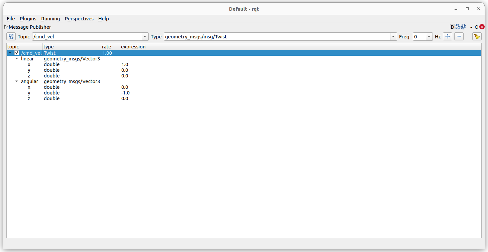

<h1>ROS 2 Workshop Instructions - Day 1</h1>

This first exercise aims to introduce the very basics of ROS 2. This is done by writing a simple node with basic functions, ir order to explore some key points in ROS. We'll also analyze the files used to build and manage dependencies for the package.

## 1) Introduction

You will be working with two packages for this task: ```spaceship_interfaces``` and ```spaceship```. As the names imply, we will be making a node that simulates a spaceship! 

Each part of the tutorial consists of implementing some functionality. The skeleton of the code has been provided, as well as the files to build the node. Your job is to fill in the blanks.

There are also conceptual questions in this file. Resources on where to find the answers are provided.

## 2) Task 0: Setting up

You may have noticed when downloading the files that they came inside a folder called day 1. You might have some trouble if you just try running or building the code directly. The reason for that is because ROS expects a very particular directory structure for it to work.

---

**QUESTION**: Considering the files given, what would the structure be for you to be able to use these packages as ROS packages? 

**HINT**: You can find this answer in the lecture slides.

**ANSWER**:

ROS expects a top-level workspace which must contain (at least) an src folder. Like this:

```
top_level_ws/
|src/
```

For the packages, you can put them individually inside the ```src``` folder:

```
top_level_ws/
|src/
||spaceship_interfaces/
||spaceship/
```

Alternatively, you can also just move the whole ```day1``` folder under ```src```. ROS know how to find the packages inside by searching for the CMakeLists.txt files.

```
top_level_ws/
|src/
||day1/
|||spaceship_interfaces/
|||spaceship/
```

---

From the top-level workspace folder, you can build the packages with:

```bash
colcon build --symlink-install
```

This command will by default build all packages that are in the ```src/*``` path. You can change both the path of packages and the packages built with ```colcon``` flags.

---

**QUESTION**: What additional folders appear when you tell ROS to build packages?

**HINT**: You can find this answer in the lecture slides.

**ANSWER**: 

```build/```

```install/```

```log/```

---

---

**QUESTION**: Why is it a good practice to use ```--symlink-install```?

**HINT**: [link](https://answers.ros.org/question/296081/use-of-symlink-install/)

**ANSWER**:

Your ```install/``` folder contains many files from the packages, such as URDF files, launch files, config files and libraries. Rather then going for the original files in the package folders, when ROS needs those files it looks inside the ```install/```. This is a ROS 2 behavior that was not really present in ROS 1.

When you build without ```--symlink-install```, ROS copies the specified files. When you change them, you need to rebuild the packages. With the flag, changes in the original will propagate, as the files inside ```install/``` are only symbolic links. 

Note that this does not influence compiled files: if you change your cpp source, you´ll still need to rebuild the package.

---

Build the packages in the workspace. You might get some warnings about unused parameters. Just ignore them for now. 

In order to access the packages built, you need to source the current environment (called the "overlay"). This will add the packages and resources in the workspace to your ROS environment:

```bash
source install/setup.bash
```

**Note**: official ROS documentation says to open a new terminal before doing this. Honestly, this is overkill in most cases... if you're getting weird results, open a new terminal. For convenience, I even add the overlay sourcing to my ```.bashrc``` file because I'm lazy.

If you want to run the package for testing, use:

```bash
ros2 run spaceship spaceship
```

You should see... absolutely nothing (including no errors!).

## 2) Task 1: Publisher and code basics

Open the file ```spaceship.cpp```. You're going to start filling its skeleton now.

As mentioned, the code simulates a spaceship! At least in abstract terms...

Your first task will be to write a publisher that broadcasts the spaceship's distance relative to the Sun. If you take a look at the private variables in the ```Spaceship``` class, you'll see the constants needed for kinematics calculation have been provided:

```cpp
double speed_to_sun_ = 17.0; // kps

double initial_distance_to_sun_ = 24'579'015'078; // km
```
Speaking of the ```Spaceship``` class, this is a good moment to explain it. At it's declaration, we see:

```cpp
class Spaceship : public rclcpp::Node
```

This means it inherits from the ```rclcpp``` (Ros Client Library - C++) ```Node``` class. Whenever you're coding a node, be it in cpp or python (```rclpy```), your node class should inherit from the general node in the client library.

**Note**: it is generally a good idea to keep your code following the OOP paradigm, rather than just calling the client library functions in a procedural manner, as some tutorials show. You'll see why soon.

Let us go back to the problem of writing the broadcaster. 

---
**QUESTION**: in the ```private``` section of the class, under the comment for "part 1", create two class attributes: 1) a shared pointer timer to control the frequency of the published messages and 2) a publisher shared pointer that will be responsible for the actual sending of the messages into the ROS network. Assume the published message will just be a string. 

**HINT**: Take a look at the [official ROS tutorial](https://docs.ros.org/en/humble/Tutorials/Beginner-Client-Libraries/Writing-A-Simple-Cpp-Publisher-And-Subscriber.html). They are a generally good source of info.

**ANSWER**:

Your code should look something like this (names of variables are irrelevant):

```cpp
rclcpp::TimerBase::SharedPtr distance_publishing_timer_; // Timer to control publisher frequency

rclcpp::Publisher<std_msgs::msg::String>::SharedPtr distance_publisher_; // Actual publishing mechanism
```
---

We need to also have a way to store the time when the program started. This is a great opportunity to talk about time syncing in ROS. 

Time syncing is a pretty common problem in robotics. By default, ROS reads the system time (also know as "wall-time"). This means that if you're running nodes on different machines, you must find a way to get all clocks synced. On the other hand, nodes running on the same machine tend to keep their clocks neatly synced. You can also have the nodes read from a simulation time: if the node parameter ```use_sim_time``` is set to true (we´ll see parameters in a sec), the node will read time from topic ```/clock``` published by the simulation rather than from the system. All nodes have this parameter and it is set to false by default. 

You can read more about time and clocks in ROS here:

- [ROS Wiki](https://wiki.ros.org/Clock#Using_Simulation_Time_from_the_.2BAC8-clock_Topic)
- [ROS 2 Design](https://design.ros2.org/articles/clock_and_time.html)

---

**QUESTION**: Create a class attribute that will store the moment the node is started.

**HINT**: Take a look at the ```now()``` method in the [rclcpp API](https://docs.ros2.org/ardent/api/rclcpp/classrclcpp_1_1_node.html#af706b231620f1c120b7ccd738ec31867) 

**ANSWER**:

```cpp
rclcpp::Time start_time_;
```
---

Now let's take a look at the class constructor:

```cpp
Spaceship() : Node("voyager_spaceship")
```

This instantiates the ```rclcpp::Node``` from which the class inherited, giving the ROS node the name "voyager_spaceship. It is inside the constructor that you will initialize the class attributes declared previously.

---

**QUESTION**: Initialize the attributes declared in the previous questions, under the comment for task 1. Constraints:

- Name the topic where the messages will be published as ```distance```, with a queue size of 10
- Have the publisher publish at a frequency of 1Hz
- Use function ```distance_publishing_callback``` as the publisher callback

**HINT**: Adapt the ROS 2 tutorial for creating a node (previously linked here) to suit your needs.

**ANSWER**:

```cpp
this->distance_publisher_ = this->create_publisher<std_msgs::msg::String>("distance", 10); // Announce the topic that will be published to

this->distance_publishing_timer_ = this->create_wall_timer(std::chrono::seconds(1), std::bind(&Spaceship::distance_publishing_callback, this)); // Set a callback timer for a frequency of 1 Hz

this->start_time_ = this->now(); // Save starting time
```
---

Now it is time to build the callback. As mentioned, the function ```distance_publishing_callback``` will be responsible for publishing the distance message. We will build it by parts.

---

**QUESTION**: Inside the function body, declare the message that will be published by the node. 

**HINT**: You an use ```auto``` keyword for variable declaration. Consult the previous code to see what message type object is being expected.

**ANSWER**:
```cpp
auto message = std_msgs::msg::String(); // Message declaration
```
---

We need to do math to calculate the current position of the spaceship relative to the sun. For that, we need to find the time passed since the start of the program.

---
**QUESTION**: Get the time, in seconds, passed since the node started.

**HINT**: Consult the operators available for the ```rclcpp::Time``` class [here](https://docs.ros2.org/ardent/api/rclcpp/classrclcpp_1_1_time.html). Notice there is another class involved.

**ANSWER**:

```cpp
rclcpp::Duration time_duration = this->now() - this->start_time_; // Subtraction of two Time classes

double time_duration_seconds = (double) (time_duration.nanoseconds()/1e9); // Conversion to seconds in double type
```
---

Now use the constants provided with the time you just calculated to find the distance to the Sun.

---

**QUESTION**: Write the math expression that yields the distance from Sun to spaceship.

**HINT**: Just assume the simplest case possible, with the velocity pointed entirely away from the Sun.

**ANSWER**:

```cpp
double current_distance = this->initial_distance_to_sun_ + this->speed_to_sun_*time_duration_seconds; // Math exp
```

---

Finally, publish the message to the topic!

---

**QUESTION**: Create a string that contains both the distance from the Sun and the time elapsed, in seconds, since the program start. Then publish the message to the topic. 

**HINT**: Take a look at [this tutorial](https://docs.ros.org/en/humble/Tutorials/Beginner-Client-Libraries/Writing-A-Simple-Cpp-Publisher-And-Subscriber.html)
 to get the right idea.

**ANSWER**:

```cpp
message.data = "Distance to Sun is " + std::to_string(current_distance) + " km at time " + std::to_string(time_duration_seconds) + " s"; // Message generation

this->distance_publisher_->publish(message); // Message publication
```
---

## 3) CLI Tools

Compile the code using ```colcon``` as shown before (ignore the warnings relating to other parts of the code) and resource the overlay workspace. Then run the ```spaceship``` node in the ```spaceship``` package. You should see... nothing again!

The reason for that is because your node is publishing messages inside a topic, not printing them to the terminal. But using the CLI (command line interface) provided by ROS, you can see the messages regardless.

Keep the ```spaceship``` node running and open a new terminal. Type ```ros2``` and use the "tab" key to autocomplete. A number of suggestions should have popped up.

---

**QUESTION**: Of the suggestions that popped up, which command do you think is useful to get information on the nodes running? What about the topics?

**HINT**: The names of the commands are pretty self explanatory...

**ANSWER**:

- ```ros2 node``` for node info.
- ```ros2 topic``` for topic info.

---

The CLI is a fantastic tool for understanding your ROS environment, and you can read more about it [here](https://docs.ros.org/en/humble/Tutorials/Beginner-CLI-Tools.html).

For example, say you want a list of nodes running. You can do

```bash
ros2 node list
```

And see the following result in the terminal:

```
/voyager_spaceship
```
---

**QUESTION**: What would be the command for printing running topics? What are the topics currently running?

**HINT**: It is analogous to the command for nodes...

**ANSWER**:

```bash
ros2 topic list
```
With topics:

```
/distance
/parameter_events
/rosout
```
---

We want to see what messages are being produced on a topic. 


---

**QUESTION**: Type ```ros2 topic -h``` to get a list of available commands for topic. Which one do you think is useful for echoing messages being published?

**HINT**: Look at the names again...

**ANSWER**:

```bash
ros2 topic echo
```

---

If we run ```echo``` followed by a topic name, we get the message written before:

```bash
ros2 topic echo /distance
> data: Distance to Sun is 24579041054.228409 km at time 1528.013436 s
```

Notice the time in the message above: even though we specified the topic to be published at 1Hz, the interval between two successive messages is not exactly 1 sec (but close!). Keep in mind when programming. 

## 4) Task 2: Subscriber

We already wrote a publisher. Now suppose the spaceship is supposed to also subscribe to a topic. We want this topic to listen for velocities. More specifically, 6-axis velocities. A 6 velocity command is usually called a "Twist".

---

**QUESTION**: Using the CLI tools, search for ROS interfaces involving twists. List the msg interfaces that implement twists.  

**HINT**: ```ros2 interface list | grep "Twist"```

**ANSWER**:

```
geometry_msgs/msg/Twist
geometry_msgs/msg/TwistStamped
geometry_msgs/msg/TwistWithCovariance
geometry_msgs/msg/TwistWithCovarianceStamped
```
---

Say we don´t care about covariance for now. We also don´t care about stamping the message, which would yield information about the frame id and message time (we´ll talk about frames in the future). Therefore, we will use just the plain twist message.

---

**QUESTION**: In a similar manner to what you did for the publisher, write a private class attribute that will subscribe to messages of type ```geometry_msgs/msg/Twist```. 

**HINT**: If stuck, take a look here [here](https://docs.ros.org/en/humble/Tutorials/Beginner-Client-Libraries/Writing-A-Simple-Cpp-Publisher-And-Subscriber.html) for inspiration.

**ANSWER**:

```cpp
rclcpp::Subscription<geometry_msgs::msg::Twist>::SharedPtr velocity_subscriber_; // Subscriber mechanism

```

---

You might have noticed we did not declare a timer. The reason for that is because subscribers don´t operate in a constant manner. Instead, an action will only be performed when a message is received by the node on the subscriber's topic.

Following the same path that was done for the publisher, you now have to start the subscriber, binding it to a function. That is done in the node constructor. 


---

**QUESTION**: Initialize the subscriber in the class constructor. Constraints:

- Name the topic where the messages will be received as ```cmd_vel```, with a queue size of 10
- Use function ```velocity_subscription_callback``` as the subscriber callback

**HINT**: Adapt the ROS 2 tutorial for creating a node (previously linked here) to suit your needs.

**ANSWER**:

```cpp
this->velocity_subscriber_ = this->create_subscription<geometry_msgs::msg::Twist>("cmd_vel", 10, std::bind(&Spaceship::velocity_subscription_callback, this, std::placeholders::_1)); // Announce the topic that will listen to velocities + callback
```
---

This is a good moment to talk about two things:

1) The choice for ```cmd_vel``` as a topic name was not arbitrary. It is very common for velocity twists to be sent across topics with that name, following an original standard set by the turtlebot robots. You can find this info in [REP 119](https://ros.org/reps/rep-0119.html). [REPs - ROS Enhancement Proposals](https://ros.org/reps/rep-0000.html) are a set of ROS guidelines established by the developer community to standardize symbols and practices. Most professional packages, such as ROS2 Control or Nav2 follow the REP standards.

2) Notice the argument ```std::placeholders::_1```, which was not present when binding the publisher. Notice the signature for the function ```velocity_subscription_callback()```. You can see it takes an argument. Since the argument will depend on the message being received, the binding takes a placeholder as an argument to keep that space "reserved" for the upcoming message.


Now is is time to write the body of the callback.

---

**QUESTION**: Write the body of the ```velocity_subscription_callback```. This will be simple: just write all 6 components of the twist to the console with 2 decimal places. Don't use ```printf``` function: logging in ROS is done in another way.

**HINT**: Check out the tutorial for writing a node and the [RCLCPP_INFO](https://docs.ros2.org/bouncy/api/rclcpp/logging_8hpp.html#aeb160b6dd1edb7273480560c1027b264) function.

**ANSWER**:

```cpp
RCLCPP_INFO(this->get_logger(), "Spaceship got the following velocity command: v=(%.2f, %.2f, %.2f), w=(%.2f, %.2f, %.2f)", msg.linear.x, msg.linear.y, msg.linear.z, msg.angular.x, msg.angular.y, msg.angular.z); // Logging
```
---

## 5) RQt Tools

Compile the package and run the spaceship node. Even though this time we logged the info inside the callback to the console, still nothing is printing. The reason for that is because there are no messages coming in through ```cmd_vel```.

You could run a teleop node. For example, on another terminal, run:

```bash
ros2 run teleop_twist_keyboard teleop_twist_keyboard
```

If you press the keys shown in the teleop console and then move back to the spaceship console, you should see some message like:

```
[INFO] [1723317348.860140518] [voyager_spaceship]: Spaceship got the following velocity command: v=(0.50, 0.00, 0.00), w=(0.00, 0.00, 0.00)
```

That is because the keyboard teleop node publishes its commands to ```cmd_vel```. That is useful when you want to remote control the robot.

Another option is to use RQt. [RQt](https://docs.ros.org/en/humble/Concepts/Intermediate/About-RQt.html) is a GUI for interacting with ROS. It consists of multiple plugins for topic interaction, service calling, image viewing, etc. Debugging using graphical tools is much easier than through the terminal. 



If you select the "plugins" tab on the top of the screen, then "topics->message publisher", a new interface should pop up. From there, you can select the topic, message type and frequency you wish to publish. Click on the "+" symbol to add the selection to the list. Once you are done editing values, check the box next to the topic to start publishing, such as in the picture below. 



Logs on the terminal are shown below. Note their frequency compared to the message publisher image.

```
[INFO] [1723318007.389180580] [voyager_spaceship]: Spaceship got the following velocity command: v=(1.00, 0.00, 0.00), w=(0.00, -1.00, 0.00)
[INFO] [1723318008.438732786] [voyager_spaceship]: Spaceship got the following velocity command: v=(1.00, 0.00, 0.00), w=(0.00, -1.00, 0.00)
[INFO] [1723318009.489920590] [voyager_spaceship]: Spaceship got the following velocity command: v=(1.00, 0.00, 0.00), w=(0.00, -1.00, 0.00)
[INFO] [1723318010.539392951] [voyager_spaceship]: Spaceship got the following velocity command: v=(1.00, 0.00, 0.00), w=(0.00, -1.00, 0.00)
[INFO] [1723318011.568370053] [voyager_spaceship]: Spaceship got the following velocity command: v=(1.00, 0.00, 0.00), w=(0.00, -1.00, 0.00)
[INFO] [1723318012.568077373] [voyager_spaceship]: Spaceship got the following velocity command: v=(1.00, 0.00, 0.00), w=(0.00, -1.00, 0.00)

```

RQt is a fantastic tool! Take some time to look at its other options when you can.

## Appendix

Parameters
Difference between services and topics
ROS 2 interfaces are not typically in the same path
Why placeholders?
Talk about callbacks and executors - thread efficiency. Comps and lifecycle

---

**QUESTION**: 

**HINT**: 

**ANSWER**:

---