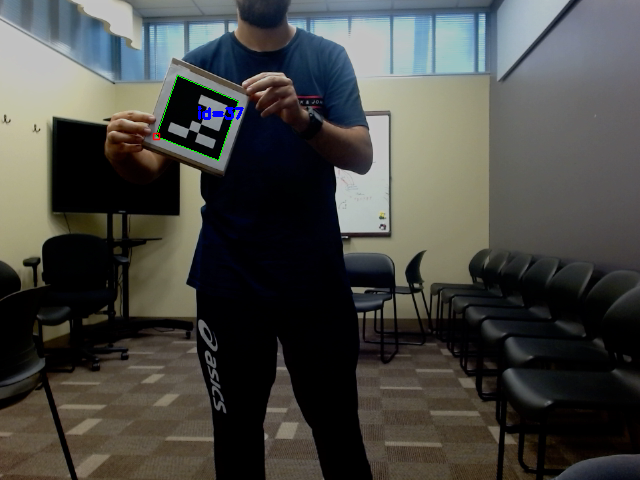

<h1>ROS 2 Workshop Instructions - Day 2</h1>

On this second exercise, we will move on to some more advanced things. We will talk about using external packages and libraries, setting them up as dependencies and building sources with them. We will also talk about ROS bags, the special ```/tf``` topic for transformations and launch files. 

## 1) Introduction

You will be working with one package for this task: ```camera_tag```. On this package you will use a recorded video stream with ArUco tags to compute relative poses. 

As before, you will complete the file, with answers provided. Since this tutorial takes place after day 1, it is expected that you already know how to set your ROS environment. 

## 2) Bags

Inside the ```bags``` directory in the ```camera_tag``` package, you can see a tar file called ```video_bags_compressed```. Uncompress it to reveal a directory.

This directory is a ROS bag. [Bags](https://docs.ros.org/en/humble/Tutorials/Beginner-CLI-Tools/Recording-And-Playing-Back-Data/Recording-And-Playing-Back-Data.html) are recordings of ROS topics that ocurred when some network was running. When you run a ROS network, you can record the messages exchanged on topics of your choosing, so you can play them back later for debugging purposes.

```bash
ros2 bag record [topics...]
```

By default, the bag is saved as a timestamped folder, which contains the message database and meta information about the topics recorded. You can change the folder's name too if you wish.

---

**QUESTION**: Suppose you wish to record all topics on a network to a bag named "cool_robot_data". What command should be used?

**HINT**: Type ```ros2 bag record --help``` on a terminal and examine the options...

**ANSWER**: 

```bash
ros2 bag record -a -o cool_robot_data
```

**NOTE**: The bag will be saved to wherever you have the terminal open.

---

Take a look at the bag provided. You can see exactly what was recorded (topics and types), when, the bag size, etc. 

---

**QUESTION**: Which command should be run to get info on a bag? What topics/types were recorded in the bag provided?

**HINT**: ```ros2 topic --help```

**ANSWER**: 

```bash
ros2 topic info <bag-name>
```
```
Topic information: 
Topic: /camera_info | Type: sensor_msgs/msg/CameraInfo
Topic: /image_raw | Type: sensor_msgs/msg/Image 
```
---

Play the bag using ```ros2 bag play <bag-name>```. In a separate terminal, open RQt and select the plugin ```image viewer```. You should be able to see a video of an ArUco tag being moved around on topic ```image_raw```.

We will now use a ROS node to detect the ArUco tag and publish an image where the tag is properly bounded. For that, we will need to add dependencies, including OpenCV. 

## 3) Dependencies and building

In the previous tutorial, the ```CMakeLists.txt``` and ```package.xml``` have been provided. In this tutorial, you will need to edit them yourself. These files are fundamental when developing for ROS:

- ```package.xml```: This file contains meta information about your package, such as dependencies, author, purpose, etc. 

- ```CMakeLists.txt```: For packages running C++ nodes, this tells the system how to actually build the package into executables, including directions on linking, file names, versions, etc.

### package.xml

Let us start by analyzing the ```package.xml``` file. Info on this file can be found both in the [official tutorial](https://docs.ros.org/en/humble/Tutorials/Intermediate/Rosdep.html) and in [REP 149](https://ros.org/reps/rep-0149.html), which lists the tags to be used.

The first few tags describe the xml format used, as well as the package name and version. The package name should be consistent across the package folder, ```package.xml``` and ```CMakeLists.txt```

```xml
<?xml version="1.0"?>
<?xml-model href="http://download.ros.org/schema/package_format3.xsd" schematypens="http://www.w3.org/2001/XMLSchema"?>
<package format="3"> <!-- Either 2 or 3. 3 recommended -->
  <name>camera_tag</name>
  <version>0.0.0</version>
</package>
```
---
**QUESTION**: Add a description and a maintainer to ```package.xml``` .

**HINT**: Look for the appropriate tags.

**ANSWER**: 

Should look something like this:

```xml
<description>This package uses OpenCV to detect ArUco markers in an image topic</description>
<maintainer email="yourname@domain.com">Firstname Lastname</maintainer>
```
---

The most important part of the ```package.xml``` file are the tags that yield information on how to build the actual package. Take, for example, the tags:

```xml
<buildtool_depend>ament_cmake</buildtool_depend>
<export>
    <build_type>ament_cmake</build_type>
</export>
```
These tags tell the system to expect a C++ type of package and use build system ```build system``` (more on that in a sec). They are added automatically when you [create a package](https://docs.ros.org/en/humble/Tutorials/Beginner-Client-Libraries/Creating-Your-First-ROS2-Package.html). 

Another very important tag is ```depend```. This tag is widely used in C++ projects and tells the system that you need the package specified at build time and at run time. This contrasts, for example, with the tag ```exec-depend```, mostly used for Python projects and that tell your system a package is only needed at runtime (Python packages aren't built anyway).

You can know which name to put inside the tag from three places:

- [Here](https://github.com/ros/rosdistro/blob/master/humble/distribution.yaml) for ROS 2 packages.

- [Here](https://github.com/ros/rosdistro/blob/master/rosdep/base.yaml) for system-wide and C++ libraries.

- [Here](https://github.com/ros/rosdistro/blob/master/rosdep/python.yaml) for Python packages.

For example: we will need the ROS Client Library C++ for the package we are building. From the first link, we see that there is a package entry for it, copied here:

```yaml
rclcpp:
    doc:
        type: git
        url: https://github.com/ros2/rclcpp.git
        version: humble
    release:
        packages:
        - rclcpp
        - rclcpp_action
        - rclcpp_components
        - rclcpp_lifecycle
        tags:
        release: release/humble/{package}/{version}
        url: https://github.com/ros2-gbp/rclcpp-release.git
        version: 16.0.10-1
    source:
        test_pull_requests: true
        type: git
        url: https://github.com/ros2/rclcpp.git
        version: humble
    status: maintained
```

So we could link this package with tags as:

```xml
<depend>rclcpp</depend>
```

---

**QUESTION**: Add the following packages as ```<depend>``` tags in the ```package.xml```:

- ```cv_bridge```, which converts ROS images to OpenCV format.
- ```sensor_msgs```, which will be used to read and publish images.
- ```std_msgs```, which is used to make headers.

**HINT**: Check the link for ROS package names to use the right ones. Package ```cv_bridge``` is more tricky: it comes as part of the ```vision_opencv``` packages. 

**ANSWER**: 

```xml
<depend>rclcpp</depend>
<depend>std_msgs</depend>
<depend>sensor_msgs</depend>
<depend>vision_opencv</depend>
```
---

Regarding the ```cv_bridge``` package just mentioned, even if you had listed it in the xml rather than ```vision_opencv```, your code would probably still be fine. That is because ```cv_bridge``` is part of the ```perception``` variant of ROS Humble, which is installed by default with the ```full-desktop-install```. You can check the variants in this [link](https://github.com/ros2/variants) to see what each of them entails. You can also see the variants available through the ROS 2 packages distributions linked above.


Finally, the program we will run also needs OpenCV. You can look up how to list the OpenCV C++ library from the link mentioned earlier for libraries and system dependencies. 

---

**QUESTION**: Add a tag for a dependency on OpenCV to ```package.xml```.

**HINT**: Search for the tag name [here](https://github.com/ros/rosdistro/blob/master/rosdep/base.yaml). The name of the library is ```lib(something)-dev```.

**ANSWER**: 
```xml
<depend>libopencv-dev</depend>
```
---

An important point on cross-platform compatibility should be made here. Even though [REP-149](https://ros.org/reps/rep-0149.html) specifies that you can add a version attribute for the tags on ```package.xml```, that would be kind of pointless for a library like OpenCV. Ubuntu 22 ships with version [4.5.4 by default](https://linux-packages.com/ubuntu-jammy-jellyfish/all-packages?q=libopencv-dev), which is also the version that you get by running ```apt install```. This means that even if you specify another version, the ```rosdep``` tool that interacts with ```package.xml``` will not be able to install it anyway and you would have to build from source. If your goal is to run the same code across multiple platforms, tags in the ```package.xml``` file alone will not be enough.


Speaking of ```rosdep```, this tool interacts with the tags in ```package.xml``` and with the entries in the yaml files listing packages/libraries to install the required dependencies to your system. The tool's instructions can be found [here](https://docs.ros.org/en/humble/Tutorials/Intermediate/Rosdep.html).

To start up ```rosdep```:

```bash
apt install python3-rosdep
sudo rosdep init
rosdep update
```

To use it:

```bash
rosdep install --from-paths src -y --ignore-src
```

Explaining the arguments from the official tutorial:
    
- ```--from-paths src``` specifies the path to check for package.xml files to resolve keys for. For this to work this exact way, run the tool from the root workspace. 

- -y means to default yes to all prompts from the package manager (```apt``` in Ubuntu, which will be called under the hood) to install without prompts.

- --ignore-src means to ignore installing dependencies, even if a rosdep key exists, if the package itself is also in the workspace.

### CMakeLists.txt

The ```CMakeLists.txt``` file is where you will tell the build system, ```ament_cmake```, how to actually make nodes out of your source code. The [original tutorial](https://docs.ros.org/en/humble/Tutorials/Beginner-Client-Libraries/Writing-A-Simple-Cpp-Publisher-And-Subscriber.html) has basic instructions on how to build files, but in here they shall be explained in more detail.

In the next steps, we will closely follow the [official instructions for ament\_cmake](https://docs.ros.org/en/humble/How-To-Guides/Ament-CMake-Documentation.html). This system is based on ```cmake```, so it might also help to take a look at [their tutorial](https://cmake.org/cmake/help/latest/guide/tutorial/index.html). For a discussion on why ```ament_cmake``` was created and ```catkin_tools``` from ROS 1 was deprecated, check this [ROS design article](https://design.ros2.org/articles/ament.html). Finally, for a complete CMake guide, check out Craig Scott's "[Professional CMake](https://crascit.com/professional-cmake/)" book.

The first part of the ```CMakeLists.txt```, and which comes by default when you create the package, is to set the project name and CMake version:

```cmake
cmake_minimum_required(VERSION 3.8)
project(camera_tag)
```

For the CMake version, stick with default number given, but if you absolutely must change it, don't go below Version 3.5, or you risk triggering deprecation warnings. As for the name, keep it the same as the ```package.xml``` (by now you should have seen that renaming packages in ROS can be a bit of a pain...).

Skip the ```if()``` section, which is just declaring additional configs for the compiler to show warnings. The next important part are the ```find_package()``` commands. These tell the build system to locate the packages needed to build your code. For example, look at the command:

```cmake
find_package(rclcpp REQUIRED)
```
The system will look for the ```.cmake``` file associated with this package, which is either ```rclcppConfig.cmake``` or ```rclcpp-config.cmake``` (this naming is common for all cmake files). It finds the file at ```/opt/ros/humble/share/rclcpp/cmake/rclcppConfig.cmake```. The path ```opt/ros/humble``` is part of the ```AMENT_PREFIX_PATH``` environment variable, which is set when you source your ROS environment, and that is how the system knows where to look. For ROS package dependencies, you find the package by the package name. This variable also includes packages in your overlay, so you can also link other packages in your workspace. 

---

**QUESTION**: Add the dependencies for the other three ROS packages we are using for the project. 

**HINT**: Same as the command above, just change the package name.

**ANSWER**: 

```cmake
find_package(std_msgs REQUIRED)
find_package(sensor_msgs REQUIRED)
find_package(cv_bridge REQUIRED)
```
---

For C++ libraries, the logic is a bit tricker. The ```.cmake``` file for OpenCV is not in the opt ROS folder. 

---

**QUESTION**: Find where the ```.cmake``` file for OpenCV is. Is the path either in ```AMENT_PREFIX_PATH``` or ```CMAKE_PREFIX_PATH```?

**HINT**: 

```bash
find / -name *.cmake 2>/dev/null | grep -i "opencv"
```

**NOTE**: For extra points, can you explain why this command is used?

Use ```env``` command to display environment variables. 

**ANSWER**: 

```/usr/lib/x86_64-linux-gnu/cmake/opencv4/OpenCVConfig.cmake```

It is NOT in the paths listed by the two environment variables.

---

If the ```.cmake``` file is not in the paths, how can it be found when compiling? What happens is that the system will first search for OpenCV in the places specified by ```AMENT_PREFIX_PATH``` and ```CMAKE_PREFIX_PATH```. When the search fails, the system will then try the DEFAULT places where the library could be installed. In Ubuntu, the ```/usr/``` directory is one of the default places, which means the library can be found. Packages installed via ```apt``` very rarely go to non-default places, but the moral of the story here is: if you have a required library, and it is in a non-default place nor listed in the environment variables, then you need to [manually add its path](https://cmake.org/cmake/help/latest/command/add_library.html#command:add_library) to ```CMakeLists.txt```.


---

**QUESTION**: Add a ```find_package()``` command for opencv too inside ```CMakeLists.txt```.

**HINT**: Same format as the others. Look at the name in the ```.cmake``` file for OpenCV to check for capitalization. 

**ANSWER**: 

```cmake
find_package(OpenCV REQUIRED)
```
---

After the packages have been found, you can build your source code. The first task is to create an executable from the source code:

```cmake
add_executable(aruco_detection src/aruco_detection.cpp)
```

The first argument is how the executable will be called (doesn't have to be the same as the source). The second argument (and more, if they exist) are the sources.

Next, you link the executable to the packages previously listed. This tells the system how to execute the appropriate substitutions. 

```cmake
ament_target_dependencies(aruco_detection rclcpp std_msgs sensor_msgs cv_bridge OpenCV)
```

The first argument is the executable, followed by the dependencies. Note that ```ament_target_dependencies()``` is preferred to the traditional ```target_link_libraries()```.

Then you install the executable. This will add a link to it in the ```install/``` folder of the workspace and is essential for other packages to call that executable when needed.

```cmake
install(TARGETS
  aruco_detection
  DESTINATION lib/${PROJECT_NAME}
)
```

Lastly, the file ends with a call to

```cmake
ament_package()
```

Which lets the system know this is a ROS/ament package. This should be the last thing on the file. 

Mastering the ```CMakeLists.txt``` is essential for advanced ROS (and C++) developers.

You can now build the package:

```bash
colcon build --symlink-install --packages-select camera_tag
```

## 4) Bridging

Look at the file ```aruco_detection.cpp```. This time, rather than writing it, you will analyze this short file to figure out what is going on. 

You can see the file subscribes to the ```image_raw``` topic, previously determined to exist in the ROS bag. It also publishes images to a topic called ```image_aruco```. You can see that in the end the file does not need ```std_msgs```, despite the fact it was added to the ```package.xml``` and ```CMakeLists.txt``` files. Adding extra packages will not break the build process, but they should be removed when possible to avoid linking unneeded dependencies. 

The cool part happens inside the ```aruco_detection_callback()``` function, which is called when the node receives a raw image. Remember from the lecture that some packages/nodes have the special function of bridging ROS things to formats used by other libraries.

---

**QUESTION**: What code line bridges the ```sensor_msgs::msg::Image``` type to something OpenCV can understand?

**HINT**: Look at the code...

**ANSWER**: 

```cpp
cv_ptr_ = cv_bridge::toCvCopy(image, "bgr8");
```
---

In the line above, we convert the image to a format that OpenCV understands. To be more specific, we make a pointer to an object that has an ```image``` attribute. This attribute is a [cv::Mat](https://docs.opencv.org/4.5.4/d3/d63/classcv_1_1Mat.html) object, which is what OpenCV uses to perform operations. We also use "bgr8" encoding in the destination image, since that is the OpenCV default.

This is followed by a sequence of lines for detecting [ArUco tags in the image](https://docs.opencv.org/4.5.4/d3/d63/classcv_1_1Mat.html). 

---

**QUESTION**: What is the dictionary used? How could you make that a variable to be changed depending on user input?

**HINT**: Look at the code and remember the previous exercises.

**ANSWER**:

The code uses ```DICT_ARUCO_ORIGINAL```, because that was the tag used in the video. You could make that a parameter that could be changed at runtime if you wanted.

---

Finally, with the markers drawn in the OpenCV image, we convert it back to ```sensor_msgs::msg::Image``` and publish it.

---

**QUESTION**: In the line:

```cpp
image_with_aruco_publisher_->publish(*image_aruco);
```

Why do we use a dereferenced pointer rather than just ```image_aruco```?

**HINT**: The answer lies in the line above. What does function [toImageMsg()](https://github.com/ros-perception/vision_opencv/blob/rolling/cv_bridge/src/cv_bridge.cpp) return?

**ANSWER**: 

The function returns a shared pointer to ```sensor_msgs::msg::Image```, so we need the dereference in order to properly publish.

---

Running the code together with the ROS bag (in separate terminals), you should see the image with the marker on RQt:




## 5) Advanced concepts and standards

Back in ROS 1, the standard was to use [image transport](http://wiki.ros.org/image_transport) as the way to deal with images, rather than using ```sensor_msgs::msg::Image``` directly. Now, this package also exists in [ROS 2](https://github.com/ros-perception/image_common/tree/humble/image_transport), and is still the best way to deal with images.

---

**CHALLENGE**: Can you change the source code (and the package metadata and build files) so that it uses image transport?

---